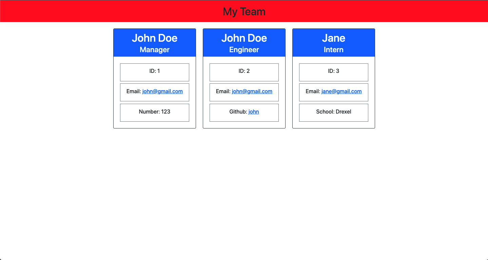

# challenge-10-team-builder

# This project uses the inquirer package for command line prompts and jest as a testing framework.

# All of the test files are available in the __test__ folder

# Once you run the application, you will be prompted for a series of questions related to the manager, engineer and intern

# After completing the prompts, an index.html will load based on the user input.

# Here is the result of the html output:

Repo Link: https://github.com/fayazl/challenge-10-team-builder
